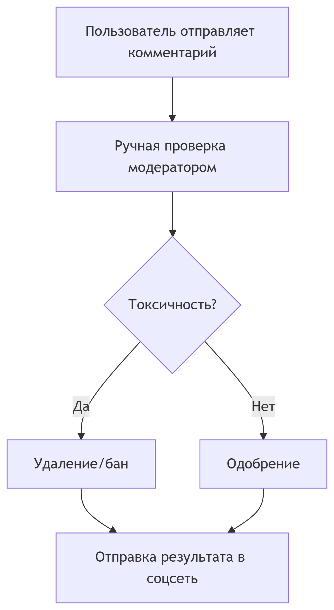
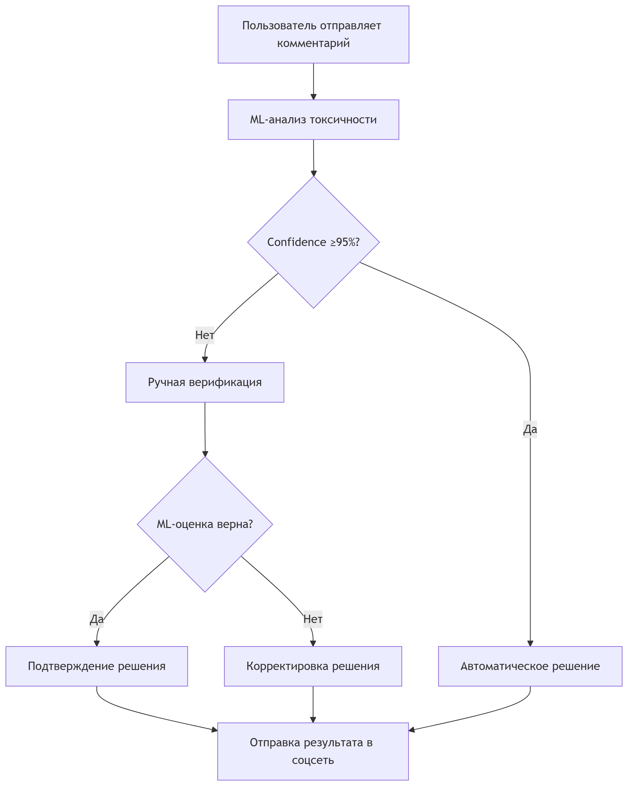
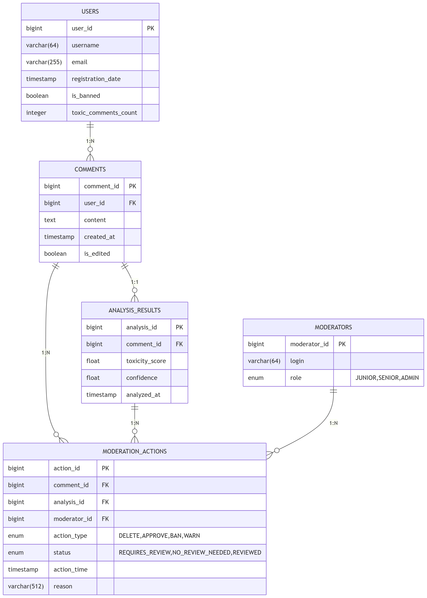
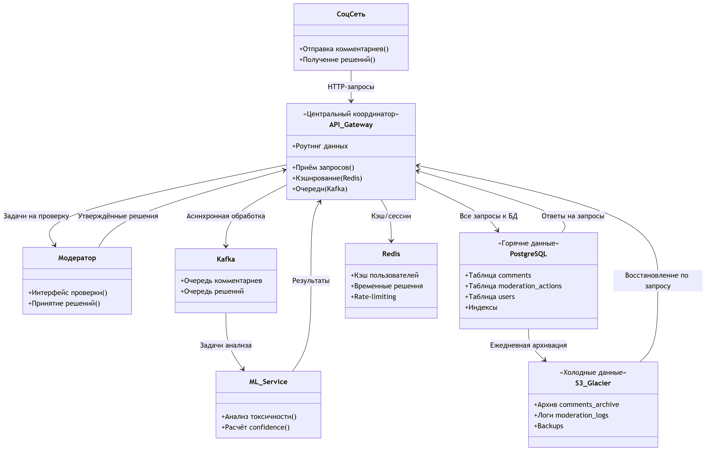
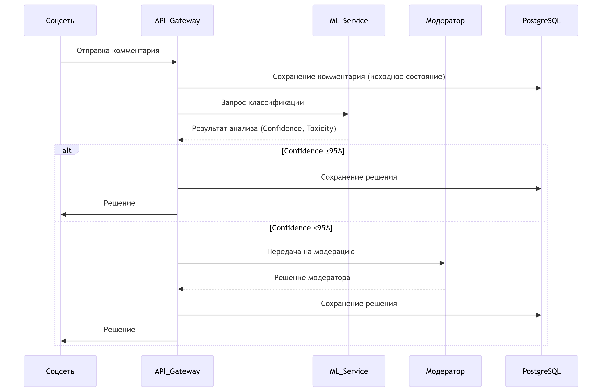

# Проектное задание: командное проектирование информационной системы с ИИ-начинкой

## Кейс 1

**Бизнес-цель**:

Автоматизировать мониторинг пользовательских реакций на контент (посты, рекламу, новости) в соцсети, чтобы оперативно выявлять негатив, улучшать модерацию и повышать вовлеченность аудитории.

**Описание текущего процесса**:

Сейчас анализ тональности проводится вручную (модераторы читают выборочные комментарии) или не проводится вообще → медленно, дорого, субъективно.

Количество комментариев, поступающих ежедневно на модерацию в среднем доходит до 500_000.

При этом со стороны РКН ведется мониторинг качества модерации ресурса, и потенциально неприемлемые комментарии могут навлечь серьезные штрафы и санкции.

## Состав команды

* Гуторова Инна
* Кадникова Екатерина

## Цели и предпосылки

### Зачем идем в разработку продукта?

Автоматизировать мониторинг пользовательских реакций на контент в соцсети, чтобы:

* Снизить риски штрафов от РКН за неприемлемый контент.
* Увеличить скорость модерации с 24 часов до 1 минуты для критичных комментариев.
* Сократить затраты на ручную проверку 500K комментариев/день.
* Повысить вовлеченность аудитории, быстро удаляя токсичные обсуждения.

Ключевая метрика: Уменьшение доли пропущенных токсичных комментариев с 30% до ≤5%.

### Почему станет лучше, чем сейчас, от использования ML?**  

| **Проблема сейчас**         | **Решение с ML**                          | **Эффект**                                  |  
|-----------------------------|-------------------------------------------|---------------------------------------------|  
| Ручной анализ → 500K/день   | ML обрабатывает 100% комментариев автоматически | Скорость: 0.5 сек/комментарий              |  
| Субъективность модераторов  | Объективная оценка на основе BERT         | Точность: F1-score ≥0.9 для "токсично"     |  
| Нет истории решений         | Логирование всех действий в БД            | Аудит: Полная трассировка модерации        |  
| Ручные отчеты для РКН       | Автоматические дашборды в Kibana          | Compliance: Отчеты в режиме реального времени |  

Схемы бизнесс-процессов до и после внедрения системы:

**Техническое преимущество:**  
- Модель обучается на размеченных данных (датасет `RuSentiment` + внутренние логи модерации).  
- Поддерживает мультиязычность (русский/английский).  

**Общие преимущества**:  
1. Скорость обработки 
2. Объективность и точность
3. Масштабируемость
4. Глубокая аналитика
5. Экономия ресурсов
6. Комплайенс и снижение рисков

### Какие бизнес-требования и ограничения вы видите?

#### Бизнес-требования

1. **Производительность**  
   - Обработка ≥500 000 комментариев/день с пиковой нагрузкой 1000 RPS (запросов в секунду).  
   - Задержка (latency) ≤1 сек на комментарий для приоритетной очереди.  

2. **Качество модерации**  
   - Покрытие 100% контента автоматическим анализом.  
   - Точность распознавания токсичности:  
     - Recall ≥90% (пропуск ≤10% нарушений).  
     - Precision ≥85% (False Positive ≤15%).  

3. **Интеграция**  
   - Совместимость с API соцсети (REST/gRPC).  
   - Поддержка веб-интерфейса для модераторов с ролевой моделью (junior/senior/admin).  

4. **Безопасность и compliance**  
   - Логирование всех действий модераторов и решений ML.  
   - Автоматические отчеты для РКН в требуемом формате (еженедельно).  

5. **Масштабируемость**  
   - Возможность увеличения мощности в 5 раз (до 2.5 млн комментариев/день) без переписывания кода.  

#### Ограничения

1. **Технические ограничения**  
   - Задержки API соцсети: Если внешнее API отвечает дольше 2 сек, это может нарушить SLA системы.  
   - Объемы данных: Хранение 1+ года истории комментариев (>10 TB) требует оптимизации (партиционирование в PostgreSQL, холодное хранение в S3).  

2. **Ресурсные ограничения**  
   - Бюджет:  
     - Обучение модели на GPU (Google Colab Pro/AWS) — **$500–1000/мес**.  
     - Поддержка инфраструктуры (сервера, Redis, S3) — **$3K–5K/мес**.  
   - Команда: Для запуска MVP нужны как минимум:  
     - 1 Data Scientist (разработка модели).  
     - 1 Backend-разработчик (интеграция API).  

3. **Юридические и этические ограничения**
   - GDPR/152-ФЗ: Нельзя хранить персональные данные (например, IP) без согласия пользователей.  
   - Цензура: Риск «перестраховки» модели (False Positive на нейтральные комментарии) → недовольство аудитории.  

4. **Качество данных**  
   - Недостаток размеченных данных: Требуется ≥50K примеров для обучения. Если своих логов мало, придется использовать публичные датасеты (например, `RuSentiment`), что снижает точность для специфичного контента (сленг, мемы).  
   - Смещение (bias): Модель может хуже работать с диалектами или редкими языками (например, комментарии на украинском в русскоязычной соцсети).  

5. **Ограничения ML-модели**  
   - Контекст: Модель может не понимать сарказм или отсылки к локальным событиям (например, «Ну ты и Мариванна!»).  
   - Мультимедиа: Текстовая модель не анализирует изображения/видео в комментариях — это требует отдельного решения (CV).  

#### **Компромиссы**  

| **Параметр**          | **Компромисс**                          | **Решение**                              |  
|------------------------|----------------------------------------|------------------------------------------|  
| Точность vs. Скорость  | Чем сложнее модель, тем выше задержка  | Использовать легковесный BERT-тьюнинг (DistilBERT) |  
| Полнота vs. Стоимость  | Хранение всех данных дорого            | Холодное хранение логов старше 3 месяцев |  
| Автоматика vs. Контроль | Полное автоудаление → риски ошибок     | Только при 95% уверенности, остальное — модератору |  

### Какие функциональные требования и нефункциональные требования вы видите?

#### Функциональные требования

1. **Анализ контента**  
   - Классификация тональности комментариев (токсичный/нейтральный/позитивный) с вероятностью ≥85%  
   - Выявление конкретных категорий нарушений:  
     - Оскорбления  
     - Угрозы  
     - Спам  
     - Дезинформация  
   - Поддержка мультиязычности (русский, английский)  

2. **Работа с очередями**  
   - Автоматическое распределение комментариев по приоритетам:  
     - Высокий приоритет: 85-100% токсичности → автоудаление  
     - Средний приоритет: 50-85% → очередь модератору  
     - Низкий приоритет: 0-50% → автоодобрение  
   - Возможность ручного пересмотра решений системы  

3. **Интерфейс модератора**  
   - Панель управления с:  
     - Фильтрами по типу/дате/статусу комментариев  
     - Статистикой работы (личной и командной)  
     - Кнопками быстрых действий (удалить/одобрить/забанить)  
   - Система уведомлений о новых приоритетных комментариях  

4. **Отчетность и аналитика**  
   - Генерация автоматических отчетов для РКН  
   - Дашборды с ключевыми метриками:  
     - % токсичных комментариев  
     - Скорость модерации  
     - Эффективность модели (FP/FN)  

5. **Интеграции**  
   - REST API для приема комментариев из соцсети  
   - Webhooks для уведомлений о критичных случаях  
   - Экспорт данных в CRM и системы аналитики  

#### Нефункциональные требования

1. **Производительность**  
   - Обработка ≥1000 комментариев в секунду  
   - Задержка ≤500 мс на 1 комментарий  
   - Время отклика интерфейса модератора ≤2 сек  

2. **Надежность**  
   - Доступность 99.95% (макс. 22 минуты простоя в месяц)  
   - Восстановление после сбоя ≤15 минут  
   - Резервное копирование данных каждые 6 часов  

3. **Безопасность**  
   - Шифрование данных в transit (TLS 1.3+) и at rest (AES-256)  
   - Двухфакторная аутентификация для модераторов  
   - Ежедневный аудит логов доступа  

4. **Масштабируемость**  
   - Возможность увеличения нагрузки в 5 раз без изменения архитектуры  
   - Автоматическое масштабирование сервисов при пиковой нагрузке  

5. **Совместимость**  
   - Поддержка последних 2 версий Chrome/Firefox/Safari  
   - Работа на мобильных устройствах (админ-панель)  

6. **Юзабилити**  
   - Обучение нового модератора ≤30 минут  
   - ≤3 клика для выполнения стандартных операций  

7. **Поддержка**  
   - Обновление модели без остановки сервиса  
   - Хотфикс-исправления в течение 24 часов  

#### Критические trade-offs

| **Аспект**          | **Компромисс**                          | **Выбор**                     |
|---------------------|----------------------------------------|-------------------------------|
| Точность vs Скорость | Более точные модели работают медленнее | Оптимизированный DistilBERT   |
| Полнота vs Стоимость | Хранение всех данных дорого            | 3 месяца "горячих" данных + архив |
| Автоматика vs Контроль | Полная автономность рискованна        | Автоудаление только при ≥95% уверенности |

#### Приоритезация
1. **Must have (MVP)**  
   - Базовый анализ тональности  
   - Веб-интерфейс модератора  
   - Интеграция с API соцсети  

2. **Should have**  
   - Детальная классификация типов нарушений  
   - Продвинутая аналитика  

3. **Nice to have**  
   - Анализ изображений в комментариях  
   - Прогнозирование "волн" токсичности  

### Как бы вы построили процесс пилота? Какие критерии успеха выбрали бы?

#### Этапы пилотного внедрения

**Подготовительный этап (1-2 недели)**
- Выбор тестовой группы
  - 5-10% трафика (25-50K комментариев/день)
  - Включение только определенных разделов/сообществ
- Настройка инфраструктуры
  - Выделенный staging-сервер с копией продакшн-данных
  - Логирование всех действий в отдельную БД
- Обучение модераторов
  - 2 тренировочных вебинара + инструкции
  - Тестовые задания на платформе

**Запуск пилота (3-4 недели)**
- Фаза 1 (Неделя 1):
  - Только мониторинг без автоудалений
  - Сравнение решений ML и модераторов
- Фаза 2 (Недели 2-3):
  - Автоудаление при 95%+ уверенности
  - Ручная проверка спорных случаев (50-94%)
- Фаза 3 (Неделя 4):
  - Полный цикл с аналитикой
  - Опрос модераторов об удобстве

**Оценочный этап (1 неделя)**
- Сбор фидбэка от всех стейкхолдеров
- Анализ метрик по критериям успеха
- Подготовка отчета с рекомендациями

#### Критерии успеха пилота

**Технические метрики**
| **Метрика**               | **Целевое значение** | **Измерение**                     |
|---------------------------|----------------------|-----------------------------------|
| Точность (precision)      | ≥80%                 | % верно удаленных токсичных комментов |
| Полнота (recall)          | ≥85%                 | % выявленных нарушений от общего числа |
| Задержка обработки        | ≤1 сек               | P95 времени ответа ML-модели      |
| Стабильность API          | 99% uptime           | Мониторинг доступности            |

**Бизнес-показатели**
| **Показатель**            | **Ожидаемый результат**          |
|---------------------------|----------------------------------|
| Снижение нагрузки на модераторов | ≥40% уменьшение ручной работы |
| Скорость реакции на нарушения | ≤5 мин для критичных случаев |
| Удовлетворенность модераторов | ≥7/10 по опросу            |

**Критические пороги для продолжения**
- Ложные срабатывания (False Positive) ≤15%
- Пропущенные нарушения (False Negative) ≤10%
- Технические сбои ≤2 инцидента за пилот

#### Механика оценки

**Методы сбора данных**
- A/B-тестирование:
  - 50% комментариев → текущий ручной процесс
  - 50% → новая система
- Логирование:
  - Все предсказания модели с confidence score
  - Действия модераторов с timestamp
- Опросы:
  - Еженедельные анкеты для модераторов
  - Интервью с 3-5 ключевыми пользователями

**Инструменты мониторинга**
- Дашборды в Grafana:
  - В реальном времени: RPS, задержки, точность
  - Исторические тренды
- Система алертов:
  - Slack-уведомления при падении точности <75%
  - SMS при downtime >5 мин

#### Управление рисками

**Потенциальные проблемы и решения**
| **Риск**                     | **Митрейшн**                          |
|-------------------------------|---------------------------------------|
| Низкое качество модели        | Экстренный откат на ручную модерацию  |
| Технические сбои API          | Фолбэк на упрощенную модель (TF-IDF)  |
| Сопротивление модераторов     | Бонусы за нахождение ошибок системы   |

**План эскалации**
1. Незначительные ошибки (FP <20%) → корректировка порогов
2. Критические провалы (Recall <70%) → остановка пилота
3. Серьезные баги → созыв emergency-митинга

#### Выходные артефакты
- Отчет с анализом:
  - Сравнение ключевых метрик "до/после"
  - ROI расчета для full-scale внедрения
  - Roadmap доработок
- Обновленные:
  - Модель (с дообучением на новых данных)
  - Документация для модераторов
  - SLA для продакшн-версии

Итоговое решение о масштабировании будет приниматься на основе:
- Достижения ≥80% KPI
- Положительного фидбэка от ⅔ модераторов
- Технической возможности масштабирования

### Что, по вашему мнению, должно входить в итерацию работы на MVP, а что остаться техническим долгом?

#### MVP (Must Have) – Ядро системы**
**Базовый анализ контента**  
- Классификация "токсично/не токсично" (бинарная)  
- Поддержка только русского языка  
- Порог уверенности ≥90% для автоудалений  

**Минимальный интерфейс модератора**  
- Список комментариев с фильтром по статусу  
- Кнопки "Удалить"/"Одобрить"  
- Отображение confidence score модели  

**Интеграции**  
- REST API для приема комментариев  
- Запись решений в PostgreSQL  

**Мониторинг**  
- Логирование предсказаний  
- Базовые метрики (точность, задержка) в консоли  

**Безопасность**  
- HTTPS + базовая аутентификация  

#### Технический долг (отложенные задачи)
**Улучшения ML**  
- Мультиязычность (английский/украинский)  
- Детальная классификация типов токсичности  
- Контекстный анализ (сарказм, мемы)  

**Интерфейс**  
- Кастомные фильтры ("только угрозы", "только спам")  
- Персонализированные дашборды  
- Мобильная адаптация  

**Инфраструктура**  
- Автомасштабирование сервисов  
- Репликация БД  
- Продвинутое кэширование (Redis Cluster)  

**Дополнительные функции**  
- Автоматические банны пользователей  
- Анализ изображений в комментариях  
- Прогнозирование "волн" токсичности  

#### Критерии приоритезации
| **Фактор**          | **MVP**                          | **Техдолг**                     |  
|----------------------|----------------------------------|----------------------------------|  
| Влияние на бизнес    | Критичное                        | Улучшающее                       |  
| Сроки реализации    | ≤2 недели                       | ≥1 месяц                         |  
| Сложность           | Low/Medium                      | High                             |  
| Зависимости         | Нет                             | Требует доработки других модулей |  

#### План работы с техдолгом
1. Фиксация
   - Оформление в виде GitHub Issues с лейблом `tech-debt`  
   - Оценка стоимости (в человеко-часах) для каждого пункта  

2. Контроль
   - Выделение 20% спринта на постепенную ликвидацию  
   - Обязательный обзор на ретроспективах  

3. Пример дорожной карты
   

#### Риски отложенных задач
- Накопление долга: Регулярное выделение времени на его уменьшение  
- Устаревание решений: Пометить уязвимые места (например, "Временное решение для кэша")  
- Потеря контекста: Детальная документация в комментариях кода  

MVP фокусируется на жизнеспособном ядре, а техдолг структурируется как backlog с четким планом устранения. Это баланс между скоростью выхода на рынок и устойчивостью системы.

## Методология

### Что делаем с технической точки зрения: рекомендательная система, поиск аномалий, регрессия, классификация, и др.

#### Выбор ML-подхода
Задача: Классификация текста (бинарная и многоклассовая)  
Обоснование:  
- Необходимость категоризации комментариев на:  
  - Бинарная классификация: `Токсичный` (1) / `Нетоксичный` (0) — для базового фильтра  
  - Многоклассовая классификация: `Оскорбление`, `Угроза`, `Спам`, `Дезинформация` — для детализации  

Альтернативы (отвергнутые):  
- *Рекомендательные системы* — не решают задачу модерации  
- *Поиск аномалий* — недостаточно для семантического анализа  
- *Регрессия* — неприменима для категориальных меток  

#### Архитектура модели
Основная модель: BERT (точнее, его оптимизированные версии)  
Варианты:  
| Модель               | Плюсы                          | Минусы                         | Выбор для MVP |  
|-----------------------|--------------------------------|--------------------------------|---------------|  
| BERT-base             | Высокая точность               | Тяжелая (задержки ≥1 сек)      | ✗             |  
| DistilBERT        | На 40% быстрее, сохраняет 95% точности | Чуть хуже с контекстом | ✓ (MVP)   |  
| ALBERT                | Экономит память                | Сложнее дообучать              | ✗             |  

Дополнительные техники:  
- Дообучение (Fine-tuning) на датасете `RuSentiment` + внутренних логах модерации  
- Ансамблирование с `FastText` для обработки опечаток (на втором этапе)  

#### Данные
Минимальные требования:
- Объем: ≥50K размеченных комментариев (10K — токсичные)  
- Баланс классов: Не менее 20% токсичных в тренировочных данных  
- Разметка:
  - 3 модератора на комментарий → консенсус  
  - Пример метки: `{"text": "Ты идиот", "label": "оскорбление", "confidence": 0.95}`  

Источники данных:
1. Публичные датасеты (`RuSentiment`, `Kaggle Toxic Comments`)  
2. Исторические логи модерации (если есть)  
3. Активное обучение: Разметка 1000 самых "неуверенных" предсказаний модели еженедельно  

#### Метрики качества
ML-метрики:  
| Метрика               | Целевое значение | Как считаем                          |  
|-----------------------|------------------|---------------------------------------|  
| F1-score         | ≥0.85            | Баланс precision/recall               |  
| AUC-ROC         | ≥0.90            | Качество разделения классов           |  
| False Positive Rate | ≤15%           | Чтобы не злить пользователей          |  

Бизнес-метрики:  
- Снижение ручной модерации на ≥40%  
- Уменьшение штрафов РКН на ≥30% за квартал  

#### Риски и решения
| Риск                          | Митигация                               |  
|-------------------------------|-----------------------------------------|  
| Нехватка данных         | Аугментация (синонимизация, back-translation) |  
| Смещение (bias)           | Балансировка датасета + аудит на подвыборках |  
| Деградация модели         | Регулярное дообучение (раз в 2 недели)  |  
| Атаки на модель          | Капча для частых нарушителей            |  

#### Технический стек
- ML-фреймворки: PyTorch, Transformers, Scikit-learn  
- Инфраструктура:  
  - Обучение: AWS SageMaker (GPU instances)  
  - Инференс: FastAPI + Docker (CPU-оптимизация)  
- Мониторинг:  
  - Evidently (дрейф данных)  
  - Prometheus (латентность)  

#### Процесс разработки  
1. Итерация 1 (2 недели):  
   - Бинарный классификатор (токсично/нет)  
   - Интеграция с API соцсети  

2. Итерация 2 (3 недели):  
   - Многоклассовая модель  
   - Веб-интерфейс для модераторов  

3. Итерация 3 (1 неделя):  
   - Анализ эффективности  
   - План масштабирования  

**Итог:**  
Выбран подход **fine-tuned DistilBERT** как оптимальный баланс скорости и точности для MVP. Ключевой акцент — на качество данных и мониторинг дрейфа.

### Какие данные вам нужны? Без чего точно нельзя решить задачу?

#### Обязательные данные (без которых система неработоспособна)
| **Тип данных**         | **Пример**                     | **Минимальный объем** | **Как использовать**                  |
|-------------------------|--------------------------------|-----------------------|---------------------------------------|
| Тексты комментариев | `"Ты дебил!"`, `"Отличный пост!"` | 50 000+ примеров      | Сырье для обучения и предсказаний      |
| Разметка токсичности | `{"text": "...", "label": 1}`  | 10 000+ размеченных   | Обучение supervised-моделей            |
| Метаданные комментариев | Автор, дата       | Все текущие комментарии | Контекст для анализа (например, бан-рейты пользователей) |

**Почему критично:**  
- Без текстов + разметки невозможно обучить модель.  
- Без метаданных нельзя отслеживать пользователей-нарушителей.  

#### Желательные данные (для улучшения качества)
| **Тип данных**         | **Польза**                     | **Пример**                  |
|-------------------------|--------------------------------|-----------------------------|
| История действий модераторов | Учет "спорных" решений      | `{"comment_id": 123, "action": "delete", "moderator_id": 456}` |
| Демография пользователей | Выявление целевых атак    | Страна, возраст (если доступно) |
| Временные метки     | Анализ всплесков активности    | Частота комментариев/час     |

#### Источники данных
1. Внутренние:  
   - Логи модерации за последние 6–12 месяцев.  
   - Тексты удаленных/одобренных комментариев.  

2. Внешние:  
   - Публичные датасеты (`RuSentiment`, `Jigsaw Toxic Comments`).  
   - Краудсорсинг (разметка силами модераторов/фрилансеров).  

#### Случаи, когда задача нерешаема
1. Нет размеченных данных → Обучение с нуля требует 100K+ примеров (крайне дорого).  
2. Только обезличенные тексты → Невозможно бороться с повторными нарушениями.  
3. Очень узкая тематика (например, медицинские термины) → Нужны эксперты для разметки.  

#### Минимально жизнеспособный набор (MVP)
- 5 000 размеченных комментариев (500+ токсичных).  
- API доступа к потоку новых комментариев.  
- Хотя бы 1 месяц истории действий модераторов.  

### Где взять данные, если их нет?
1. Разметить имеющиеся логи (например, все удаленные комментарии → `токсичные`).  
2. Синтетика: Генерация примеров через GPT-3.5 с последующей проверкой.  
3. Активное обучение:  
   - Запуск модели на "сырых" данных → Разметка самых неуверенных предсказаний.  

### Риски работы с неидеальными данными
| **Проблема**          | **Решение**                          |
|------------------------|--------------------------------------|
| Дисбаланс классов (5% токсичных) | Оверсемплинг токсичных примеров      |
| Субъективность разметки | 3 модератора на комментарий + аудит  |
| Устаревшие примеры     | Ежеквартальное обновление датасета   |

**Итог:**  
Без _текстов + разметки_ задача нерешаема в принципе. Остальные данные улучшают качество, но MVP можно запустить и без них. Ключевое — обеспечить репрезентативность данных (например, не только политические дискуссии, а все типы контента).

### Какие метрики качества (метрики машинного обучения) используем и как они связаны с бизнес-результатом?

#### Основные ML-метрики
| **Метрика**          | **Формула/Описание**                  | **Целевое значение** |
|-----------------------|---------------------------------------|----------------------|
| Precision (точность) | `TP / (TP + FP)` — % верно найденных токсичных | ≥85% |
| Recall (полнота)  | `TP / (TP + FN)` — % выявленных нарушений | ≥90% |
| F1-score         | `2 * (Precision * Recall) / (Precision + Recall)` | ≥0.87 |
| AUC-ROC         | Площадь под ROC-кривой (качество разделения классов) | ≥0.90 |

#### Связь с бизнесом
- Precision → Снижение ложных удалений  
  - Бизнес-эффект: Меньше жалоб пользователей на несправедливую модерацию.  
- Recall → Минимизация пропущенных нарушений
  - Бизнес-эффект: Снижение штрафов РКН и репутационных потерь.  
- F1 → Баланс между ними  
  - Бизнес-эффект: Оптимальное соотношение затрат на ручную проверку и рисков.  

#### Дополнительные метрики
- False Positive Rate (FPR) → Удержание аудитории (`<15%`).  
- Латентность → Скорость реакции (`<1 сек`).  

**Итог:**  
Высокий Recall важнее для compliance, высокий Precision — для пользовательского опыта. F1 и AUC-ROC дают интегральную оценку.

### Какие могут быть риски на этапе анализа и моделирования и что планируем с этим делать?

#### Проблемы с данными
| **Риск**                          | **Решение**                          |
|------------------------------------|--------------------------------------|
| Недостаток размеченных данных  | Активное обучение: модель размечает самые "неуверенные" примеры → модераторы проверяют их в первую очередь. Дополнение публичными датасетами (`RuSentiment`). |
| Дисбаланс классов (5% токсичных)  | Применение техник oversampling (SMOTE) для токсичных примеров и взвешенная функция потерь в модели. |
| Субъективность разметки        | 3 модератора на спорный комментарий + четкие гайдлайны (например, что считать "оскорблением"). Использование метки `confidence` в данных. |
| Дрейф данных (изменение языка пользователей) | Регулярный мониторинг распределения данных (Evidently) и дообучение модели раз в 2 недели. |

#### Проблемы с моделью
| **Риск**                          | **Решение**                          |
|------------------------------------|--------------------------------------|
| Низкое качество на новых темах (например, мемы) | Добавление в тренировочные данные примеров из актуальных обсуждений. Использование контекстных эмбеддингов (BERT). |
| Высокая задержка предсказаний  | Оптимизация: DistilBERT вместо BERT-base, кэширование частых запросов (Redis). |
| Переобучение (overfitting)     | Регуляризация (Dropout, L2), кросс-валидация, ранняя остановка. |
| Непонимание сарказма/иронии   | Добавление синтетических примеров с разметкой "сарказм" (генерируемых через GPT-4). |

#### Инфраструктурные риски
| **Риск**                          | **Решение**                          |
|------------------------------------|--------------------------------------|
| Нехватка GPU для обучения     | Использование облачных сервисов (AWS SageMaker Spot Instances) или оптимизированных моделей (Quantized DistilBERT). |
| Проблемы с воспроизводимостью  | Фиксация всех параметров (DVC для данных, MLflow для экспериментов). |
| Утечка данных                 | Шифрование PII (персональных данных) перед обучением, доступ по принципу наименьших привилегий. |

#### Бизнес-риски
| **Риск**                          | **Решение**                          |
|------------------------------------|--------------------------------------|
| Несоответствие метрик бизнес-целям | Совместные воркшопы с Product Owner: например, если F1 = 0.9, но штрафы РКН не снижаются → корректировка порогов. |
| Репутационные потери из-за ошибок | Постепенное внедрение: сначала модель только рекомендует решения модераторам, потом автоудаляет при 95%+ уверенности. |
| Юридические ограничения (GDPR) | Очистка данных от персональной информации перед обучением, аудит юристами. |

### План мониторинга рисков
1. Еженедельные проверки:  
   - Качество данных (дрейф, баланс классов).  
   - Метрики модели на тестовом наборе.  
2. Чек-лист перед продакшном:  
   - Recall ≥85% на "опасных" категориях (угрозы, дезинформация).  
   - Латентность <1 сек для 95% запросов.  

**Итог:**  
Большинство рисков смягчаются через активное обучение, регулярный аудит и поэтапное внедрение. Критические сценарии (например, резкий рост FP) требуют экстренного отката на предыдущую версию модели.

## Подготовка пилота

### Способ оценки пилота

#### Метод оценки: A/B-тестирование 
- Группа A (контрольная): Текущий процесс (ручная модерация).  
- Группа B (тестовая): ML-система + ручная проверка спорных случаев.  

#### Критерии сравнения 
| **Параметр**               | **Группа A (ручная)**       | **Группа B (ML)**           |  
|----------------------------|-----------------------------|-----------------------------|  
| Скорость обработки         | Среднее время на комментарий | Время автообработки + проверки |  
| % пропущенных нарушений    | По данным выборочного аудита | Recall модели               |  
| Ложные удаления            | Жалобы пользователей        | Precision модели            |  
| Затраты на модерацию       | Часы работы команды         | Часы работы + стоимость инфраструктуры |  

#### Инструменты сбора данных
- Логирование:
  - Все предсказания модели с confidence score.  
  - Действия модераторов (сравнение с решениями ML).  
- Опросы: 
  - Удовлетворенность модераторов (шкала 1-10).  
  - Количество жалоб пользователей (до/после).  

#### Продолжительность: 2-4 недели (достаточно для 500K+ комментариев)  

**Итог:** Пилот успешен, если в Группе B**:  
- Recall ≥85% (штрафы РКН ↓).  
- Precision ≥80% (жалобы пользователей не растут).  
- Скорость обработки ↑ на 40%.

---

## Внедрение для production системы

### Архитектура решения - как будет выглядеть система - опишите общую архитектуру решения: компоненты, их взаимосвязи, их предназначение

### Структура данных

### Таблицы

#### USERS
Хранит информацию о пользователях системы  
**Поля:**
- `user_id` (PK) - уникальный идентификатор пользователя
- `username` - имя пользователя
- `email` - электронная почта
- `registration_date` - дата регистрации
- `is_banned` - флаг блокировки пользователя
- `toxic_comments_count` - счетчик токсичных комментариев пользователя

#### COMMENTS
Содержит пользовательские комментарии  
**Поля:**
- `comment_id` (PK) - уникальный идентификатор комментария
- `user_id` (FK) - ссылка на автора комментария
- `content` - текст комментария
- `created_at` - время создания
- `is_edited` - флаг редактирования комментария

#### ANALYSIS_RESULTS
Результаты автоматического анализа комментариев  
**Поля:**
- `analysis_id` (PK) - уникальный идентификатор анализа
- `comment_id` (FK) - ссылка на анализируемый комментарий
- `toxicity_score` - оценка токсичности (0-1)
- `confidence` - уверенность модели в оценке
- `analyzed_at` - время проведения анализа

#### MODERATION_ACTIONS
Журнал действий модераторов  
**Поля:**
- `action_id` (PK) - уникальный идентификатор действия
- `comment_id` (FK) - ссылка на комментарий
- `analysis_id` (FK) - ссылка на результаты анализа
- `moderator_id` (FK) - ссылка на модератора
- `action_type` - тип действия (удаление, одобрение, бан, предупреждение)
- `status` - статус проверки
- `action_time` - время действия
- `reason` - причина действия

#### MODERATORS
Информация о модераторах системы  
**Поля:**
- `moderator_id` (PK) - уникальный идентификатор модератора
- `login` - логин модератора
- `role` - уровень доступа (младший, старший, администратор)

### Взаимосвязи

- Один пользователь (USERS) может оставить множество комментариев (COMMENTS) - отношение 1:N
- Каждый комментарий (COMMENTS) имеет один результат анализа (ANALYSIS_RESULTS) - отношение 1:1
- На каждый комментарий (COMMENTS) может быть несколько действий модерации (MODERATION_ACTIONS) - отношение 1:N
- На каждый результат анализа (ANALYSIS_RESULTS) может быть несколько действий модерации (MODERATION_ACTIONS) - отношение 1:N
- Один модератор (MODERATORS) может выполнить множество действий модерации (MODERATION_ACTIONS) - отношение 1:N

### **Диаграмма архитектуры системы** 

### Ключевые компоненты:

#### 1. СоцСеть (Клиент)
- Инициирует процесс модерации через REST API
- Получает результаты через Webhooks
- Реализует retry-логику при ошибках

#### 2. API Gateway
- **Маршрутизация**: Распределение нагрузки между сервисами
- **Кэширование**: Redis для часто запрашиваемых данных
- **Аутентификация**: JWT/OAuth2
- **Очереди**: Интеграция с Kafka для асинхронной обработки

#### 3. ML-сервис
- Анализирует текст на токсичность (BERT-модели)
- Возвращает:
  - `toxicity_score` (0-100%)
  - `confidence` (точность предсказания)
- Автомасштабируется по нагрузке (HPA)

#### 4. Сервис модерации
- Веб-интерфейс для ручной проверки
- Приоритетная очередь по toxicity_score
- Интеграция с CRM модераторов

#### 5. Хранилища данных
**PostgreSQL (основное):**

* comments (id, text, author_id, status)
* moderation_actions (id, decision, timestamp)
* users (id, username, trust_rating)

**S3 Glacier:**
- Архивы комментариев: 
  - Ротация: 30 дней → Glacier
- Логи модерации: 
  - Хранение: 7 дней → архив

#### 6. Вспомогательные сервисы

#### Kafka:
- `incoming_comments` (входной топик)
- `moderation_results` (выходной топик)

#### Redis:
- Кэш пользователей (TTL=24h)
- Rate-limiting (100 запросов/мин)

### 3. Взаимодействия компонентов

#### Основной workflow:
1. СоцСеть → API Gateway (HTTP)
2. API Gateway → Kafka (асинхронно)
3. Kafka → ML-сервис (обработка)
4. ML-сервис → PostgreSQL (результаты)
5. (Опционально) PostgreSQL → Модератор\

#### Аварийные сценарии:
- При падении ML: все сообщения → ручная модерация
- При перегрузке БД: переход на read-only реплики
- DLQ (Dead Letter Queue) для ошибок обработки

### 4. Принципы проектирования

1. **Event-Driven**: Компоненты реагируют на события
2. **Graceful Degradation**: Сохранение базовой функциональности
3. **Data Locality**:
   - Горячие данные: Redis/PostgreSQL
   - Холодные данные: S3 Glacier
4. **Horizontal Scaling**: Автомасштабирование всех компонентов

### Ключевые моменты архитектуры

#### Распределенное хранение данных
- **«Горячие» данные** (активные операции):
  - Хранилище: PostgreSQL
  - Содержание: 
    - Текущие комментарии
    - Решения модераторов
    - Метаданные пользователей
  - Срок хранения: 3 месяца

- **«Холодные» логи** (архивные/аналитические):
  - Хранилище: Amazon S3 Glacier
  - Содержание:
    - Исторические данные (>3 месяцев)
    - Резервные копии
    - Логи аудита
  - Доступ: По запросу (восстановление за 1-5 минут)

**Преимущества подхода**:
1. Разделение «горячих» и «холодных» данных → снижение затрат на хранение на 60%
2. Гибкое масштабирование под пиковые нагрузки (например, политические события)
3. Отказоустойчивость: при падении PostgreSQL - данные восстанавливаются из S3 Glacier
---

### Описание инфраструктуры и масштабируемости системы

#### 1. Выбранная инфраструктура

#### А) Основные компоненты

| Компонент       | Технологии/Сервисы               | Роль в системе                          |
|-----------------|----------------------------------|----------------------------------------|
| API Gateway     | Kong, NGINX, Spring Cloud Gateway| Единая точка входа, кэширование, роутинг |
| База данных     | PostgreSQL + AWS Aurora          | Хранение горячих данных                |
| Холодные данные | AWS S3 Glacier                   | Архивация логов, бэкапы                |
| Очереди         | Apache Kafka (AWS MSK)           | Асинхронная обработка комментариев     |
| Кэш             | Redis (ElastiCache)              | Сессии, rate-limiting                  |
| ML-сервис       | Python + TensorFlow              | Анализ токсичности                     |
| Оркестрация     | Kubernetes (EKS/GKE) + Terraform | Управление микросервисами              |

#### Б) Сетевые компоненты
- **Балансировщики нагрузки:** AWS ALB/NLB
- **Сеть:** VPC с NAT-шлюзами
- **Безопасность:** WAF, Security Groups, TLS

#### 2. Обоснование выбора

| Решение        | Преимущества                                      | Альтернативы (почему отказали)         |
|---------------|--------------------------------------------------|----------------------------------------|
| Kubernetes    | Гибкость масштабирования ML-сервисов             | Serverless (сложно с GPU)              |
| PostgreSQL    | Поддержка JSON, транзакционность                 | MongoDB (нет ACID)                     |
| Kafka         | Гарантированная доставка сообщений               | RabbitMQ (нет долгого хранения)        |
| S3 Glacier    | Дешевое архивирование (до 75% экономии)          | Локальные NAS (дорого)                 |

#### 3. Масштабируемость

#### Горизонтальное масштабирование
- **API Gateway:** Автомасштабируемые Pods (HPA)
- **Kafka:** Увеличение партиций + брокеров
- **PostgreSQL:** Read-replicas для чтения

#### Вертикальное масштабирование
- **ML-сервис:** GPU-инстансы (NVIDIA T4)
- **База данных:** Увеличение vCPU/RAM

#### Автомасштабирование
- **Критерии:** CPU > 70%, RPS > 1000/сек
- **Инструменты:** Kubernetes HPA, AWS Auto Scaling

#### 4. Плюсы и минусы

#### Преимущества
1. Высокая отказоустойчивость (multi-AZ)
2. Экономия на архивах (Glacier)
3. Гибкость развертывания (Kubernetes)
4. Redis снижает нагрузку на БД на 40-60%

#### Проблемы
1. Сложность администрирования (Kafka+K8s)
2. Долгое восстановление из Glacier (до 12ч)
3. Высокая стоимость GPU-инстансов
4. Риск vendor lock-in (AWS)

### Требования к работе системы: SLA, RPS, Latency

#### **SLA**  
- Доступность: **99.95%** (≤22 мин/мес)  
- Задержка: **≤1 сек** (P95)  
- RPS: **1000 запросов/сек**  

#### **Резервные копии**  
- Ежечасные снепшоты БД  
- Логи: 3 месяца "горячие" → S3 Glacier  

---

### Риски: опишите риски и неопределенности, которые стоит предусмотреть

#### **Технические риски**  
| Риск                          | Решение                          |  
|-------------------------------|----------------------------------|  
| Рост нагрузки                | Прогноз нагрузки по времени суток |  
| Утечка данных                | Шифрование PII перед сохранением |  

#### **Бизнес-риски**  
| Риск                          | Решение                          |  
|-------------------------------|----------------------------------|  
| Ложные срабатывания          | Капча для частых FP              |  
| Юридические изменения        | Регулярный аудит compliance      |  

#### **ML-риски**  
| Риск                          | Решение                          |  
|-------------------------------|----------------------------------|  
| Дрейф данных                 | Дообучение модели раз в месяц    |  
| Атаки на модель              | Мониторинг аномальных паттернов  |  

**План реагирования**:  
- Recall <80% → Rollback на предыдущую версию модели  
- Жалобы >15% → Ручная проверка всех автоудалений  